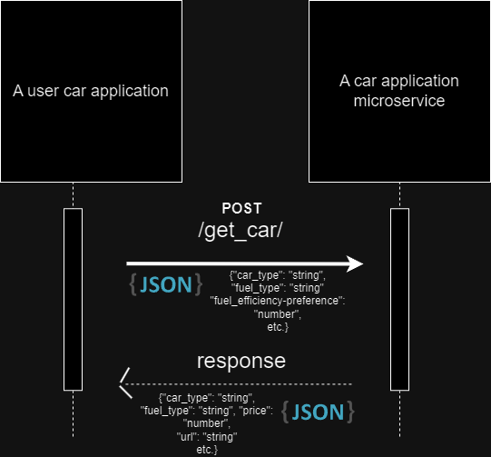

# CS361-Microservice
Microservice for CS361. This service works for my partner's project. It recieves data from the partner application in JSON format. This program then parses that data, performs computation with that data, and returns data in JSON format to be picked up by the partner application.

# How to use this service

To use this service, you need to send a POST request to the service route responsible for sending back car data.

A JSON file must be provided to the request in the following format:

"car_type": "string value", "fuel_type": "string value", 
"price_range": "int value (low)|int value (high)", 
"fuel_efficiency-preference":"int value", "high_performance-preference":"int value", 
"reliability-preference":"int value", "comfort-preference":"int value"

An example call would be:

(using POST method) http://localhost:8001//get_car/

In the above example, you provide the JSON file as part of the request.

A response will be automatically sent by the service. Your application must automatically look for a response from the original request. The JSON data is in the response itself, so the JSON data must be retrieved
from that response.

# Diagram

# Attributions

https://flexiple.com/python/python-get-current-directory/
https://stackoverflow.com/questions/17211188/how-to-create-a-timer-on-python
(second answer)
https://docs.python.org/3/library/csv.html
https://flask.palletsprojects.com/en/2.3.x/quickstart/#a-minimal-application
https://stackoverflow.com/questions/20001229/how-to-get-posted-json-in-flask
(second answer)
https://docs.github.com/en/get-started/getting-started-with-git/ignoring-files
https://stackoverflow.com/questions/10313001/is-it-possible-to-make-post-request-in-flask
(first answer)
https://pythonbasics.org/flask-http-methods/
https://www.geeksforgeeks.org/how-to-change-port-in-flask-app/#
Info from the .json() method for (requests?). https://github.com/psf/requests
https://app.diagrams.net/
https://stackoverflow.com/questions/14494747/how-to-add-images-to-readme-md-on-github
(answers 1 - 5 helped in my discovery of how to insert image to README)
https://languages.oup.com/google-dictionary-en
https://www.google.com/search?sca_esv=556432238&q=preference&si=ACFMAn-S_tFEbe5J-h2tG_x3DZ9e6V1iGTG1kym1dG9bJdUV4PAy8C7ZximM6KWNzo6HP5VS6ZaBrBcWYuY7N04ypjSwVf4_Euyb6OcC26VIZyrGqFyQuzU%3D&expnd=1&sa=X&sqi=2&ved=2ahUKEwiOxpaL1tiAAxXiPEQIHcm-C1oQ2v4IegQIGxBc&biw=1920&bih=923&dpr=1
(Google search to check spelling)
https://blog.apastyle.org/apastyle/2013/10/how-do-i-cite-a-search-in-apa-style.html#:~:text=Slightly%20Longer%20A%3A%20A%20search,or%20in%20the%20reference%20list.&text=what%20they%20did%20with%20the%20results.
https://www.seoquake.com/blog/google-search-param/#:~:text=URL%20Search&text=The%20latter%20does%20not%20require,interest%E2%80%9D(or%20as_q).
https://support.google.com/docs/answer/161768?hl=en&co=GENIE.Platform%3DDesktop
https://www.google.com/search?q=preference&oq=preference&gs_lcrp=EgZjaHJvbWUyBggAEEUYOTIKCAEQABixAxiABDIHCAIQABiABDIKCAMQABixAxiABDIHCAQQABiABDIHCAUQABiABDIHCAYQABiABDIHCAcQABiABDIHCAgQABiABDIKCAkQLhjUAhiABNIBCDEyNjZqMGo3qAIAsAIA&sourceid=chrome&ie=UTF-8

